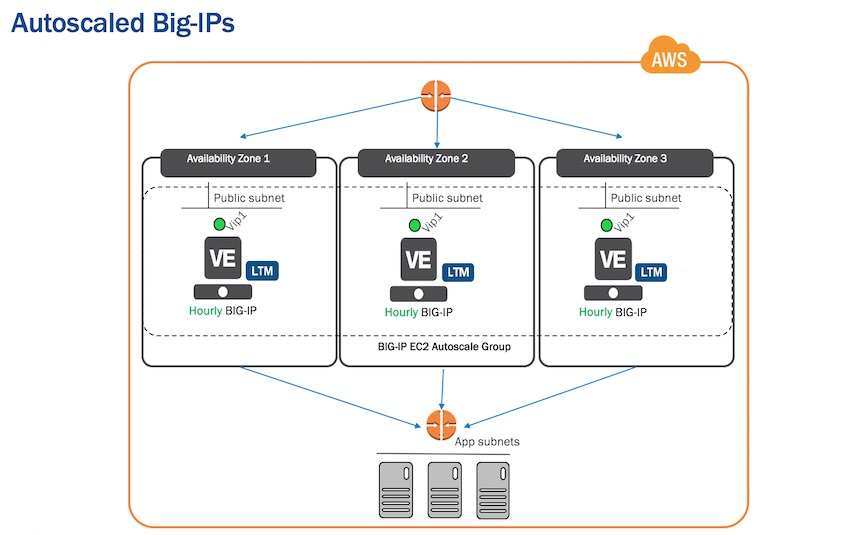

# AUTOSCALE BIGIP


This project contains CloudFormation templates which provide an example of how to deploy autoscale instances of BIG-IP in AWS. This project specifically demonstrates autoscaling the Big-IP tier where, as traffic increases, the number of BIG-IPs will increase. 





These examples demonstrate leveraging cloudinit in the launch configs to provide the configuration for the autoscaled instances. 


Another method is creating custom AMIs. For more information on that method, please see the official documentation on AskF5 (https://support.f5.com):

https://support.f5.com/kb/en-us/products/big-ip_ltm/manuals/product/bigip-ve-autoscaling-amazon-ec2-12-1-0.html

For service discovery, this example also demonstrates using Big-IPs FQDN Pools (which uses DNS to populate the pool members). For more information, please see:

https://support.f5.com/kb/en-us/products/big-ip_ltm/manuals/product/ltm-implementations-12-1-0/25.html?sr=56133323

Another service discovery method available is Big-IP's AWS Autoscale Pool Member Discovery feature:

https://support.f5.com/kb/en-us/products/big-ip_ltm/manuals/product/bigip-ve-autoscaling-amazon-ec2-12-1-0/2.html


The individual directories in the */deployments* directory contain variations of an autoscaled deployment. 

Ex.

**L7 Proxy**  

Example virtual service has a simple URI routing policy.  Deploys Big-IP Local Traffic Manager (LTM) images (License = Good).

* [**SSL-L7proxy-utility-only-immutable**] (deployments/SSL-L7proxy-utility-only-immutable)  *(uses DNS LB to distribute traffic to the Big-IPs)*
* [**SSL-L7proxy-sandwich-utility-only-immutable**](SSL-L7proxy-sandwich-utility-only-immutable)  *(uses ELB to distribute traffic to the Big-IPs)*
* [**SSL-L7proxy-sandwich-byol-and-utility-immutable**](SSL-L7proxy-sandwich-byol-and-utility-immutable)  *(uses ELB to distribute traffic to the Big-IPs)*

**Web Application Firewall (WAF)** 

Example virtual service has a simple Web Application Firewall policy. Deploys Big-IP Application Security Manager (ASM) images (License = Best). 

* [**SSL-waf-utility-only-immutable**](SSL-waf-utility-only-immutable) *(uses DNS LB)*
* [**SSL-waf-sandwich-utility-only-immutable**](SSL-waf-sandwich-utility-only-immutable)  *(uses ELB)*
* [**SSL-waf-sandwich-byol-and-utility-immutable**](SSL-waf-sandwich-byol-and-utility-immutable)  *(uses ELB)*


**Deployment Name Terms:**

**SSL** = Example virtual service terminates SSL. It imports a PKS certificate from a remote location OR uses the default crt.

**utility** = Uses hourly billing licensing.

**byol** = Bring Your Own License. Requires having a Big-IP registration key. Contact your friendly F5 Account team for eval keys.

**immutable** = Requires the configuration to be managed via the launch config. Any config changes must be entered into the launch config and relaunched.

**clustered** = *(Coming Soon)*. Configuration managed by syncing config from an existing member. Changes can be made in traditional operational method of logging into a Big-IP GUI.   

For more details about each deployment, please see the README.md in each deployment type directory. 


Quickstart: If this is your first time, recommend starting with the deployment below:

**SSL-L7proxy-sandwich-utility-only-immutable**

ex.

```
deployments/SSL-L7proxy-sandwich-utility-only-immutable/README.md
```


## Description


### Prerequisites

1) Access to Big-IP images in the Amazon region within which you are working.<br>
- Make sure that you have accepted the EULA for ALL images used in the AWS marketplace.<br>

*Note: If you do not Accept the EULA in the Marketplace, the cloudformation templates may appear to hang (please see events EVENTs tab for information as to why the templates did not "complete")*

2) Set of AWS Access Keys for use by the BIG-IP, as described here:<br>
- https://support.f5.com/kb/en-us/products/big-ip_ltm/manuals/product/bigip-ve-setup-amazon-ec2-12-0-0/4.html#unique_1903231220<br>

These keys will be used to send authenticated messages to AWS (ex. cloudwatch metrics). 

ex. The user whose keys are being used should have following policy attached:

arn:aws:iam::aws:policy/CloudWatchFullAccess


3) OPTIONAL: Upload a certificate to a private S3 bucket that the those aws keys have permisson to. Otherwise, the "default" certificate on the Big-IP will be used *(recommended for first time)*. For more information about managing SSL certificates, see the README.md in each deployment type directory (ex. /deployments/**deployment_type**/README.md). 

4) OPTIONAL - If you use the deploy_stacks.py python script per instructions below:<br>

- Install yaml and boto3<br>
```
pip install pyyaml
pip install boto3
```

- You will need an AWS Access Key and Secret Access key configured in ~/.aws/credentials with appropriate permissions to create all the EC2 objects<br>


### TWO DEPLOYMENT OPTIONS:

To use this example code, you may either 
  1) manually launch the CloudFormation templates directly 
or 
  2) use the deploy_stacks.py script *(recommended)*. 


### Method 1: Manually deploy the CloudFormation Templates 

1) Go to the Cloudformation page of the AWS console. Select "Create Stack"

2) Choose "Upload a template to Amazon S3" and navigate to the cft directory of the deployment you would like launch.

ex. Recommend:
```
deployments/SSL-L7proxy-sandwich-utility-only-immutable/cfts
```

Launch the following CFTs in the following order:

  1) common.template

  2) application.template

  3) autoscale-bigip.template

  4) byol-bigip.template (if deployment type contains it)

  5) ubuntu-client.template

This ordering is necessary because "output" values from previous templates are used as "input" parameters for later templates.  Note that "output" variables names are the same for all matching input parameters. For example, the outputs from the common.template include Vpc, Subnets, AvailabilityZones, BigipSecurityGroup, etc. so when creating later templates, you should "copy" some outputs from previous templates and "paste" them into input parameters of the next. 

Although, this method may allow you to develop a deeper understanding of the autoscaled deployments, due to numerous inputs and outputs, it is more error prone.  


### Method 2 - deploy_stacks.py

This will be the easiest and least error prone method by far. The script will launch each of the CloudFormation templates in the correct order.

To use this script:

1) Find config.yaml.example in this directory, copy this to a new file named config.yaml ( which is excluded in .gitignore to avoid publishing credentials ).   In this config.yaml file, edit the variables for your scenario. The last flag in the script 'deploy_jmeter_host' should be given a value of 'true' if you wish to test scale out using JMeter as documented below. 

2) Then run the script:
```
python ./deploy_stacks.py -d <deployment_type>

ex.
$python deploy_stacks.py -d SSL-L7proxy-sandwich-utility-only-immutable

```

Use the output of the script and/or go the output tab of each cloudformation template to get login or additional information about the deployment.


### Triggering scale out


To trigger a scale out event:

1) Go to AWS Console. Go to EC2 -> Autoscale Groups. Select the autoscale group. Select the "Details" tab, hit "Edit" and adjust the  "Desired" or "Min" values

or 

for your convenience, you can use the JMeter script included with these examples to generate traffic: 


1) If you have launched the optional ubuntu instance, copy or paste the simple_jmeter_load.xml file to the ubuntu host.

```
scp -i <path to key pair you provided in config.yaml> simple_jmeter_load.xml ubuntu@<ip address of the ubuntu instance>:/home/ubuntu
```


2)  SSH to it:
```
ssh -i <path to key pair you provided in config.yaml> ubuntu@<ip address of the ubuntu instance> 
```


3) Find and replace all instances of string "AUTOSCALE-DNS" in the simple_jmeter_load.xml script with the WIDEIP OR ELB name associated with your BIG-IP Autoscale group using editor of choice (ex. vim,nano, pico, sed, etc)

```
sed -i.bak 's/AUTOSCALE-DNS/<NEW_DNS_NAME>/g' simple_jmeter_load.xml


ex.
ubuntu@ip-10-0-1-232:~$ sed -i.bak 's/AUTOSCALE-DNS/gtm-wideip.example.com/g' simple_jmeter_load.xml
or
ubuntu@ip-10-0-1-232:~$ sed -i.bak 's/AUTOSCALE-DNS/BigipElasticLoadBalancer-1263232202.us-east-1.elb.amazonaws.com/g' simple_jmeter_load.xml

```


4) Run the script from the Ubuntu host:
```
nohup jmeter -n -t simple_jmeter_load.xml &
```

To stop traffic

```
killall java
```


5) A CloudWatch alarm will be triggered, and EC2 Autoscale will launch another BIG-IP instance. 


*Author: Alex Applebaum (a.applebaum@f5.com)*
